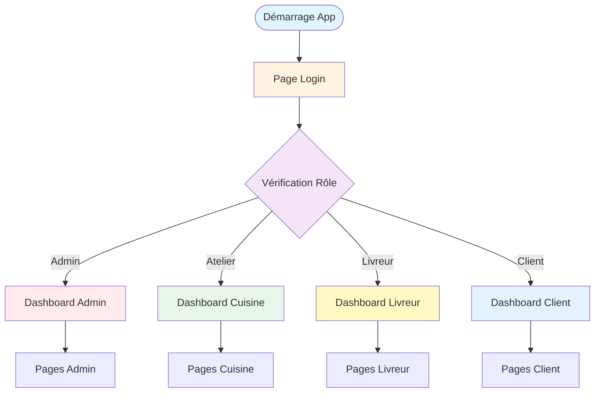
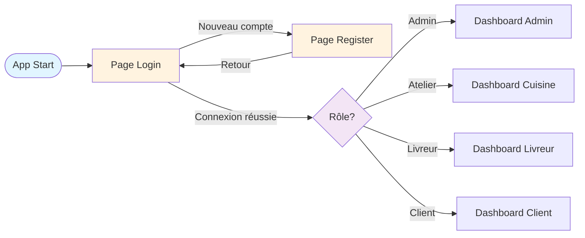
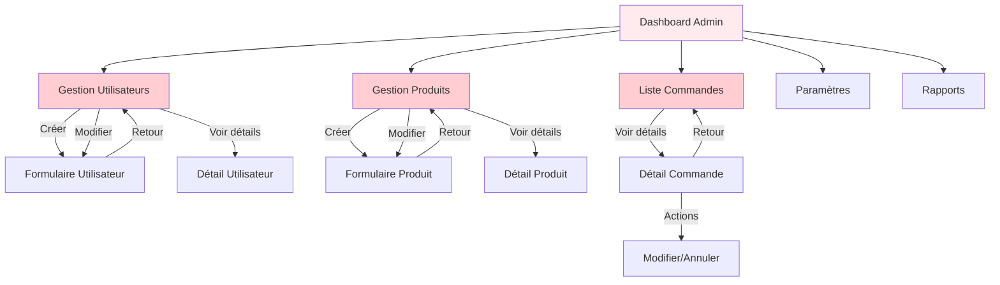
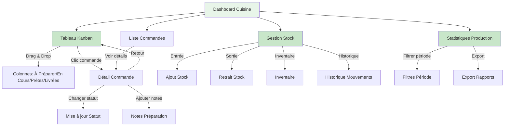
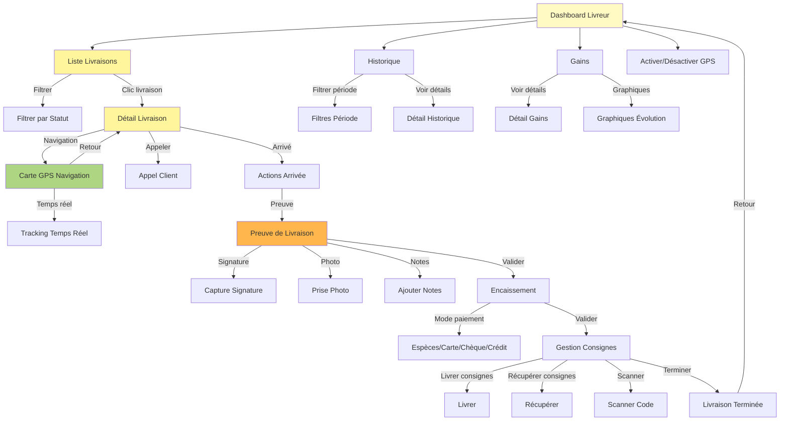
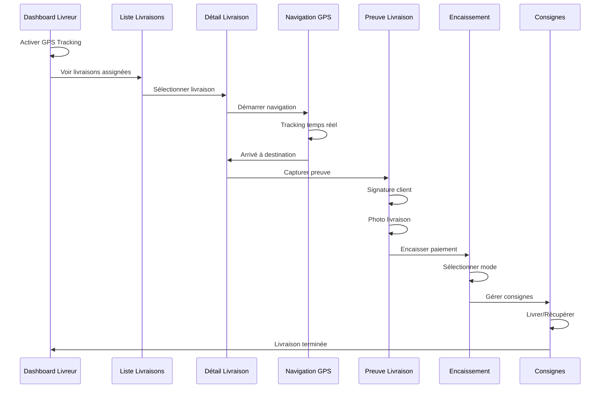
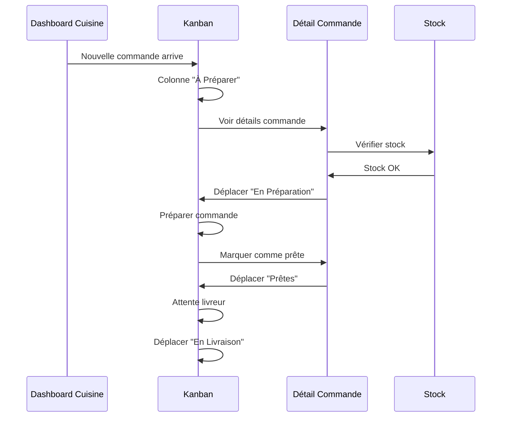
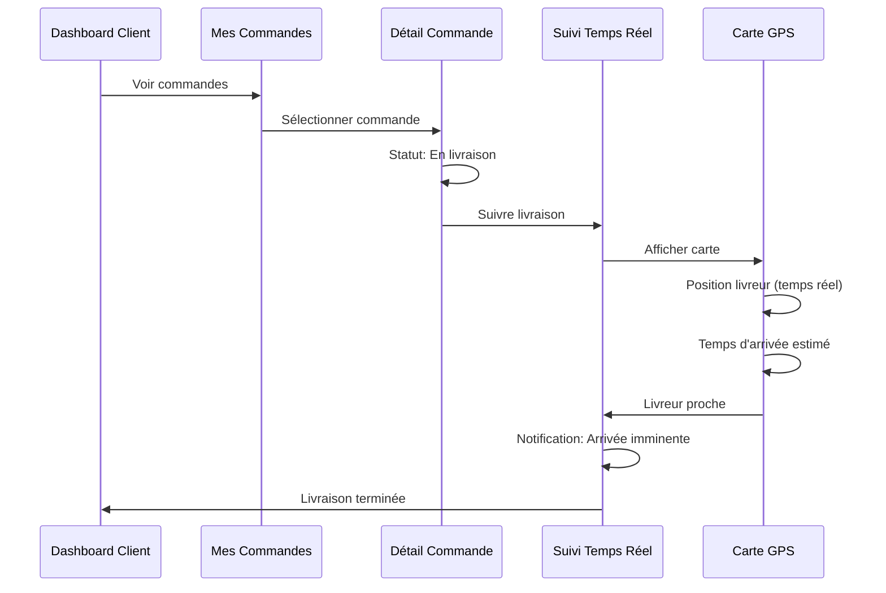

# Diagrammes de Navigation - AWID Mobile v4

## Vue d'Ensemble Globale



---

## 1. Navigation Authentification



---

## 2. Navigation Admin



---

## 3. Navigation Atelier/Cuisine



---

## 4. Navigation Livreur (Détaillée)



---

## 5. Navigation Client

```mermaid
graph TB
    CustomerDash[Dashboard Client] --> Orders[Mes Commandes]
    CustomerDash --> Credit[Mon Crédit]
    CustomerDash --> Packaging[Mes Consignes]
    CustomerDash --> Account[Mon Compte]
    CustomerDash --> ActiveDeliveries[Livraisons Actives]
    
    Orders -->|Filtrer| OrdersFilter[Filtrer par Statut]
    Orders -->|Voir détails| OrderDetail[Détail Commande]
    Orders -->|Rechercher| OrdersSearch[Recherche]
    
    OrderDetail -->|Commande en livraison| TrackDelivery[Suivi Livraison Temps Réel]
    OrderDetail -->|Récommander| Reorder[Nouvelle Commande]
    OrderDetail -->|Retour| Orders
    
    TrackDelivery -->|Carte GPS| LiveMap[Carte Position Livreur]
    TrackDelivery -->|Appeler livreur| CallDeliverer[Appel Livreur]
    TrackDelivery -->|Temps estimé| ETA[Temps d'Arrivée]
    
    ActiveDeliveries -->|Suivre| TrackDelivery
    
    Credit -->|Voir historique| CreditHistory[Historique Transactions]
    Credit -->|Voir factures| Invoices[Factures]
    Credit -->|Demander augmentation| CreditRequest[Demande Crédit]
    
    Packaging -->|Voir détails| PackagingDetail[Détail Consignes]
    Packaging -->|Historique| PackagingHistory[Historique Mouvements]
    
    Account -->|Modifier profil| EditProfile[Modifier Profil]
    Account -->|Adresses| Addresses[Gérer Adresses]
    Account -->|Sécurité| Security[Changer Mot de Passe]
    Account -->|Notifications| NotifSettings[Paramètres Notifications]
    Account -->|Déconnexion| Logout[Déconnexion]
    
    Logout --> Login[Page Login]
    
    style CustomerDash fill:#e3f2fd
    style Orders fill:#bbdefb
    style Credit fill:#bbdefb
    style TrackDelivery fill:#81c784
    style LiveMap fill:#66bb6a
```



---

## 6. Flux Complet de Livraison (Livreur)



---

## 7. Flux Complet de Commande (Cuisine)



---

## 8. Flux Suivi Client



---

## 9. Architecture de Navigation Globale

```mermaid
graph TB
    subgraph "Authentification"
        Login[Login]
        Register[Register]
    end
    
    subgraph "Admin"
        AdminDash[Dashboard]
        Users[Utilisateurs]
        Products[Produits]
        AdminOrders[Commandes]
    end
    
    subgraph "Cuisine"
        KitchenDash[Dashboard]
        Kanban[Kanban]
        Stock[Stock]
        Stats[Statistiques]
        KitchenOrders[Commandes]
    end
    
    subgraph "Livreur"
        DelivererDash[Dashboard]
        Deliveries[Livraisons]
        DeliveryDetail[Détail]
        RouteMap[GPS]
        Proof[Preuve]
        Payment[Paiement]
        DelivererPackaging[Consignes]
        DelivererHistory[Historique]
        Earnings[Gains]
    end
    
    subgraph "Client"
        CustomerDash[Dashboard]
        CustomerOrders[Commandes]
        OrderDetail[Détail]
        Tracking[Suivi]
        Credit[Crédit]
        CustomerPackaging[Consignes]
        CustomerAccount[Compte]
        CustomerHistory[Historique]
    end
    
    Login --> AdminDash
    Login --> KitchenDash
    Login --> DelivererDash
    Login --> CustomerDash
    
    style Login fill:#fff3e0
    style AdminDash fill:#ffebee
    style KitchenDash fill:#e8f5e9
    style DelivererDash fill:#fff9c4
    style CustomerDash fill:#e3f2fd
```



---

## 10. Matrice de Navigation par Rôle

| Depuis / Vers | Dashboard | Liste | Détail | Actions | Retour |
|---------------|-----------|-------|--------|---------|--------|
| **Admin** | ✓ | Users, Products, Orders | User/Product/Order Detail | CRUD | Dashboard |
| **Cuisine** | ✓ | Kanban, Orders | Order Detail | Change Status, Stock | Dashboard/Kanban |
| **Livreur** | ✓ | Deliveries | Delivery Detail | GPS, Proof, Payment, Packaging | Dashboard |
| **Client** | ✓ | Orders | Order Detail | Track, Reorder | Dashboard |

---

## 11. Hiérarchie de Navigation

```
App Root
├── Auth
│   ├── Login
│   └── Register
│
├── Admin
│   ├── Dashboard
│   ├── Users
│   │   ├── List
│   │   ├── Create
│   │   ├── Edit
│   │   └── Detail
│   ├── Products
│   │   ├── List
│   │   ├── Create
│   │   ├── Edit
│   │   └── Detail
│   └── Orders
│       ├── List
│       └── Detail
│
├── Kitchen
│   ├── Dashboard
│   ├── Kanban
│   │   └── Order Detail
│   ├── Stock
│   │   ├── List
│   │   ├── Add/Remove
│   │   └── History
│   ├── Stats
│   └── Orders List
│
├── Deliverer
│   ├── Dashboard
│   ├── Deliveries
│   │   ├── List
│   │   └── Detail
│   │       ├── Route Map (GPS)
│   │       ├── Proof of Delivery
│   │       │   ├── Signature
│   │       │   └── Photo
│   │       ├── Payment Collection
│   │       └── Packaging Management
│   ├── History
│   └── Earnings
│
└── Customer
    ├── Dashboard
    ├── Orders
    │   ├── List
    │   └── Detail
    │       └── Tracking (Real-time)
    ├── Credit
    │   └── History
    ├── Packaging
    │   └── History
    └── Account
        ├── Profile
        ├── Addresses
        ├── Security
        └── Settings
```

---

## 12. Transitions et Animations

### Transitions Principales
- **Login → Dashboard** : Fade + Slide from bottom
- **Dashboard → Pages** : Slide from right
- **Liste → Détail** : Slide from right
- **Détail → Retour** : Slide to right
- **Modal/Dialog** : Fade + Scale
- **Bottom Sheet** : Slide from bottom

### Navigation Gestures
- **Swipe Right** : Retour page précédente
- **Pull Down** : Refresh liste
- **Long Press** : Actions rapides
- **Swipe Left/Right** : Navigation entre onglets

---

## Légende des Diagrammes

- 🟦 **Bleu** : Pages Client
- 🟨 **Jaune** : Pages Livreur  
- 🟩 **Vert** : Pages Cuisine
- 🟥 **Rouge** : Pages Admin
- 🟧 **Orange** : Authentification
- ⬜ **Blanc** : Actions/Décisions

---

Ces diagrammes représentent l'architecture complète de navigation de l'application AWID Mobile v4.
